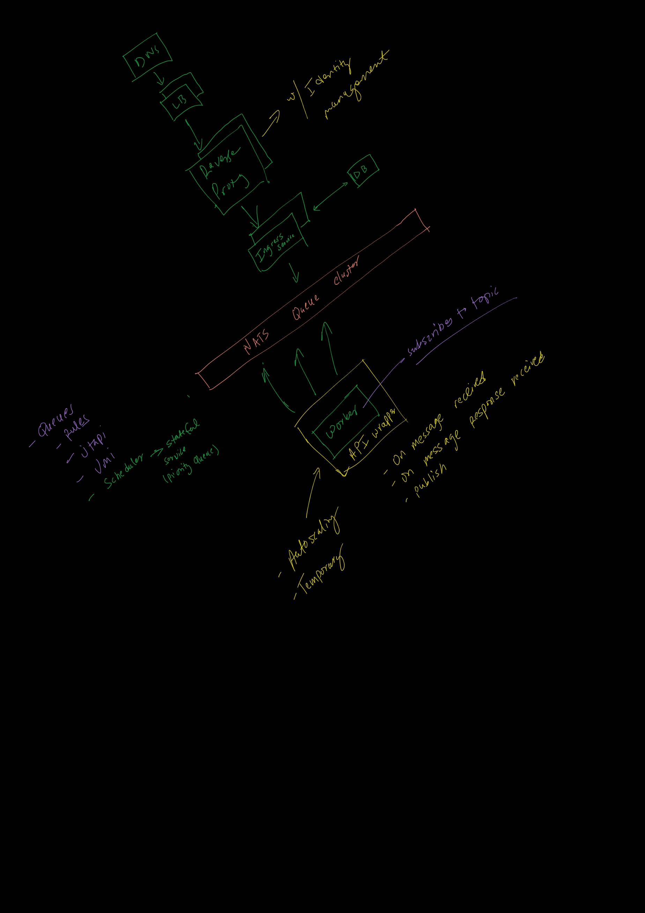

# Rules Engine Testing

## POC

This is all my personal musings to figure out how python can scale on my machine when it comes to task scheduling with millisecond precision and a rules engine. Feel free to fork and mess around with the code.

## Functional Requirements

The system must be able to receive events from variety of streams and process them based on logical rules defined by user. The system should also accept cancellations incoming from streams for specific events which should cancel all processing related to those events.

## Non-Function Requirements

System should be highly available. There is no need to support multi-region(yet). System's logical rules defined by user should be unit-testable. System should have general latency requirements of 500ms or less. Throughput does not matter as long as latency is met.

## High Level Components

- Ingress
- Logic Engine
- Scheduling
- Egress

### Details Ingress

- Receive events via REST API
    - End points:
        - POST /new-event
        - GET /status/<id>

## Questions/Analysis

1. With N tasks, when is the drift between time due and dequeue time?
    - Based on reference implementation there were different results, the function with logging slowed down to ~30 tasks before drift, and without logging was ~250 tasks before drift.
        - How does async logging help?

2. Rules implementation
    - Needs to be unit testable
    - Needs to be hot reloadable
    - Should ideally comply with general best practices
        - non recursive
        - run within allocated cycles
        - deterministic output based on input
    - Types of ways to express rules
        - Sentences(NLP) - this depends on the model used to infer logic from sentences...this is a long term goal
        - DSL
            - External
                - Design considerations
                - Lexing, ast, evaluation must be rock solid
            - Internal
                - Dependent on the platform heavily
        - YAML
            - Harder to express more complex reasoning
        - Embedded Scripting
            - Compatibility with language
            - Translation errors possible
            - Unit-testability of the scripting

## High Level Design

## Checklist

- [x] Ingress Service
- [ ] Worker API
- [ ] Scheduler Service
- [ ] Rules Engine